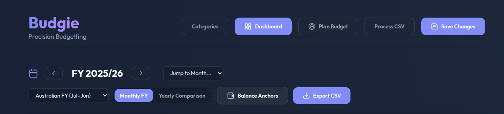
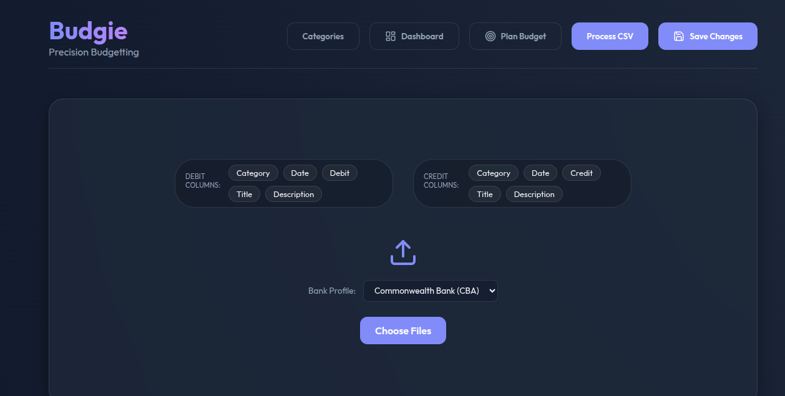

# Budgie - How To Guide

# Start
The first place to start is the Balance Anchor

This is like the Delta, it's the amount of money you have in your account at a specific point in time.

It's used as a starting point, or a correction point if there is a drift between Budgie and your financial institute.

It should be the total sum the banking balance for all of the accounts you wish to store in Budgie.

NOTE: The date input only cares for the month. The `day` is kept for historical purposes, and use of the balance anchor will adjust the Starting Balance of the selected month.

# Categories

This area contains the fuzzy matching filters, and their categories.

Be mindful to track categories that you wish to budget for, but be warry of defining too many categories or else you end up tracking transactions rather than categories of transactions.

A helpful hint of categories are:
`Groceries`, `Transport`, `Subscriptions`, `Household`, `Debt`, `Utilities`, `Entertainment`, `Takeaway`, `Savings`, `Investments`, `Children`, `Pets`, `Insurance`, `Medical`, `Personal`, `Hobbies`, `Travel`, `Clothing`, `Other`

Use categories to track your spending on areas you wish to understand further. For example you may wish to separate Coffee from Takeaway to better understand these areas.

## Filters

Once you have your Categories defined, now you can start populating the filters. These are fuzzy matching rules that translate the description in your banking statement to something human readable, and sorted into a category. This requires a lot of local knowledge of your banking statements, and may involve some trial and error.

For example, if you have a category called `Groceries`, you can add filters such as:

- Bank Description: "W/WORTHS"
- Display Title: "Woolworths"

Any transaction with one of these descriptions will be categorized as Groceries. Often these filters will end up being 1:1 with the Banking Description, and that's fine.

AVOID:
* Common words in your Bank Description field. For example, instead of using `Card Purchase PAYW W/WORTHS` just use `W/WORTHS`. This is because the fuzzy matching algorithm will try to match the description to a category, and if you use common words, it will be more likely to match to the wrong category.

* Banking Descriptions that are too short that could produce false positives. For example, do not use `BP` as a Banking Description, as it could match to many any `BPAY` transactions. If you have to create multiple filters to cover all the places you shop of that store name, then do it.

TIP:
**You can drag and drop filters from one category to another. This lets you fine-tune the filters later. Creating or Moving filters will automatically update all transactions that match the filter in the database, but remember to hit save!!**

## Transfers [System Category]

This section is supposed to catch all transactions that are transfers between accounts. They show up in your banking statements with both a credit and a debit record, and are therefore not really income or expenses, but noise in the data.

Budgie will automatically detect these transactions and move them to this category if a transaction on the same date exists with a matching amount in the credit and debit fields.

# Process CSV

This section is used to process the CSV files that are exported from your banking institution.
Select your banking institution from the dropdown menu. This will tell Budgie how to read the column headers as it imports the data. If your bank is not listed, you can add it to the config.json file, feel free to contribute any bank profiles that are missing from this project, or update any that are incorrect.

You are able to import multiple CSV files in one go. Once uploaded, they are automatically ingested into the database.

You'll notice the column order selectors. After importing your CSV Files you have the ability to download a combined version of them afterwards in CSV format. **This is optional**

# Dashboard

Coming soon...

# Plan Budget

Coming soon... This is a new feature

# Budget Targets

# Help

Open to discussion in the issues section

# License

This project is licensed under the BSD 2-Clause License - see the [LICENSE](LICENSE) file for details.
